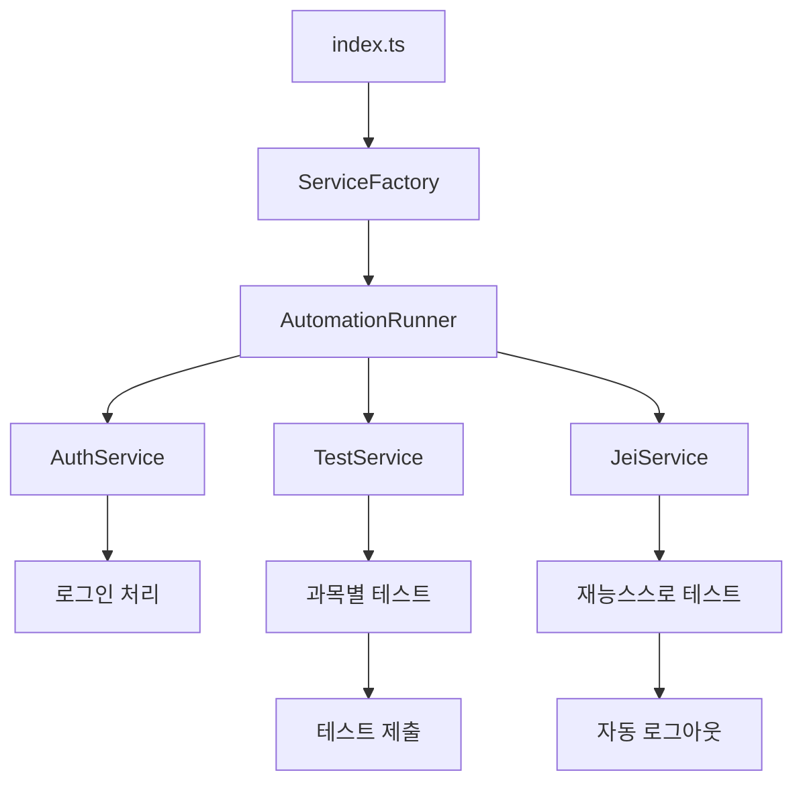

# JEI 온라인 테스트 자동화 도구

> JEI 온라인 테스트 플랫폼의 테스트 과정을 자동화하는 TypeScript 기반 도구입니다.


## 📋 목차

- [주요 기능](#-주요-기능)
- [프로젝트 구조](#-프로젝트-구조)
- [설치 및 설정](#-설치-및-설정)
- [사용법](#-사용법)
- [개발 가이드](#-개발-가이드)
- [커밋 컨벤션](#-커밋-컨벤션)
- [아키텍처](#-아키텍처)
- [라이선스](#-라이선스)

## 🚀 주요 기능

### ✨ 자동화된 테스트 워크플로우

- **자동 로그인**: 휴대폰 번호를 통한 자동 인증 처리
- **과목별 테스트**: 수학, 한자, 영어, 국어 순차적 자동 실행
- **스마트 네비게이션**: 동적 버튼 인식 및 자동 클릭
- **랜덤 선택**: 테스트 문항 랜덤 선택으로 실제 환경 시뮬레이션

### 🎯 JEI 특화 기능

- **재능스스로 카드**: 특화된 JEI 카드 테스트 자동 처리
- **테스트 재시도**: "다시 하기" 기능 자동 실행
- **결과 제출**: 테스트 완료 후 자동 제출 처리

### 🛡️ 안정성 및 모니터링

- **에러 핸들링**: 자동 스크린샷 캡처 및 로그 저장
- **실시간 로깅**: 브라우저 콘솔과 터미널 동시 로깅
- **자동 정리**: 테스트 완료 후 자동 로그아웃

## 📁 프로젝트 구조

```
src/
├── 📁 config/           # 애플리케이션 설정
│   └── config.ts
├── 📁 types/            # TypeScript 타입 정의
│   └── index.ts
├── 📁 utils/            # 공통 유틸리티
│   ├── delay.ts         # 지연 함수
│   ├── logger.ts        # 로깅 서비스
│   ├── path-resolver.ts # 절대경로 해결
│   └── screenshot.ts    # 스크린샷 캡처
├── 📁 services/         # 비즈니스 로직
│   ├── auth.ts          # 인증 서비스
│   ├── jei.ts           # JEI 특화 기능
│   ├── navigation.ts    # 페이지 네비게이션
│   └── test.ts          # 테스트 실행
├── 📁 core/             # 핵심 아키텍처
│   ├── automation-runner.ts # 메인 실행기
│   └── factory.ts       # 의존성 주입
└── index.ts             # 애플리케이션 진입점

# 설정 파일
├── tsconfig.json           # TypeScript 메인 설정
├── tsconfig.paths.json     # 절대경로 별칭 설정
├── .eslintrc.cjs          # ESLint 코드 품질 규칙
├── .prettierrc            # Prettier 포맷팅 규칙
└── .commitlintrc.cjs      # Angular 커밋 컨벤션
```

## 🔧 설치 및 설정

### 환경 요구사항

- **Node.js** 18.0.0 이상
- **npm** 8.0.0 이상

### 프로젝트 설치

```bash
# 저장소 클론
git clone https://github.com/jeonjeunghoon/jei-online-test.git
cd jei-online-test

# 의존성 설치
npm install

# TypeScript 빌드
npm run build
```

### 설정 변경

`src/config/config.ts`에서 테스트 설정을 변경할 수 있습니다:

```typescript
export const config = {
  VIEW_TEST_MODE: true, // 브라우저 표시 여부
  PHONE_NUMBER: '01012345678', // 로그인 휴대폰 번호
  TIMEOUTS: {
    PAGE_LOAD: 10000, // 페이지 로드 대기시간 (ms)
    ELEMENT_WAIT: 10000, // 요소 대기시간 (ms)
    AUTH_SUCCESS: 300000, // 인증 대기시간 (ms)
  },
  DELAYS: {
    TEST_STEP: 1000, // 테스트 단계간 지연 (ms)
    CLICK_INTERVAL: 500, // 클릭 간격 (ms)
  },
};
```

### 절대경로 설정

프로젝트는 `@` 별칭을 사용한 절대경로를 지원합니다:

```typescript
// ❌ 상대경로 (권장하지 않음)
import { config } from '../../../config/config.js';

// ✅ 절대경로 (권장)
import { config } from '@/config/config.js';
```

**사용 가능한 경로 별칭:**

- `@/*` → `src/*`
- `@/config/*` → `src/config/*`
- `@/types/*` → `src/types/*`
- `@/utils/*` → `src/utils/*`
- `@/services/*` → `src/services/*`
- `@/core/*` → `src/core/*`

## 🏃‍♂️ 사용법

### 개발 모드 실행

```bash
# TypeScript를 직접 실행 (권장)
npm run dev

# 파일 변경 감지 모드
npm run dev:watch
```

### 프로덕션 실행

```bash
# 빌드 후 실행
npm run build
npm start
```

### 코드 품질 검사

```bash
# ESLint 검사
npm run lint

# ESLint 자동 수정
npm run lint:fix

# Prettier 포맷팅
npm run format

# TypeScript 타입 검사
npm run type-check
```

## 👨‍💻 개발 가이드

### 새로운 서비스 추가

1. **인터페이스 정의** (`src/types/index.ts`)

```typescript
export interface NewService {
  doSomething(page: Page): Promise<void>;
}
```

2. **서비스 구현** (`src/services/new-service.ts`)

```typescript
export class NewServiceImpl implements NewService {
  async doSomething(page: Page): Promise<void> {
    // 구현 로직
  }
}
```

3. **의존성 주입** (`src/core/factory.ts`)

```typescript
const newService = new NewServiceImpl(dependencies);
```

### 설정 추가

1. **타입 정의** (`src/types/index.ts`)
2. **실제 설정** (`src/config/config.ts`)

## 📝 커밋 컨벤션

프로젝트는 **Angular 커밋 컨벤션**을 따릅니다.

### 커밋 메시지 형식

```
<타입>(<범위>): <제목>

<본문>

<푸터>
```

### 커밋 타입

| 타입       | 설명             | 예시                                    |
| ---------- | ---------------- | --------------------------------------- |
| `feat`     | 새로운 기능 추가 | `feat(auth): 자동 로그인 기능 추가`     |
| `fix`      | 버그 수정        | `fix(navigation): 버튼 클릭 오류 수정`  |
| `docs`     | 문서 변경        | `docs(readme): 설치 가이드 업데이트`    |
| `style`    | 코드 스타일 변경 | `style(format): prettier 적용`          |
| `refactor` | 코드 리팩토링    | `refactor(services): SOLID 원칙 적용`   |
| `test`     | 테스트 추가/수정 | `test(auth): 로그인 테스트 케이스 추가` |
| `chore`    | 빌드/패키지 관리 | `chore(deps): playwright 버전 업데이트` |

### 자동 검증

커밋 시 자동으로 다음이 실행됩니다:

- **pre-commit**: ESLint + Prettier 자동 수정
- **commit-msg**: 커밋 메시지 컨벤션 검증

## 🏗️ 아키텍처

이 프로젝트는 **SOLID 원칙**을 기반으로 설계되었습니다.

### 🎯 단일 책임 원칙 (SRP)

각 서비스는 단일 책임을 가집니다:

- `AuthService`: 인증 관련 기능만 담당
- `TestService`: 테스트 실행 관련 기능만 담당
- `NavigationService`: 페이지 네비게이션만 담당

### 🔓 개방-폐쇄 원칙 (OCP)

- 인터페이스 기반 확장 가능한 구조
- 새로운 기능 추가 시 기존 코드 수정 최소화

### 🔄 리스코프 치환 원칙 (LSP)

- 인터페이스 구현체들은 서로 교체 가능

### 🔀 인터페이스 분리 원칙 (ISP)

- 각 서비스별로 분리된 인터페이스 제공

### ⬆️ 의존성 역전 원칙 (DIP)

- 구체 클래스가 아닌 인터페이스에 의존
- 팩토리 패턴을 통한 의존성 주입

### 실행 흐름



## 📊 에러 처리

에러 발생 시 자동으로 다음 작업이 수행됩니다:

1. **📸 스크린샷 자동 저장**
   - 위치: `바탕화면/온라인테스트/YYYY-MM-DD/`
   - 파일명: `YYYY-MM-DDTHH-MM-SS.png`

2. **📝 상세 에러 로그**
   - 에러 발생 시간
   - 에러 메시지 및 스택 트레이스
   - 파일명: `YYYY-MM-DDTHH-MM-SS_error.txt`

3. **🗂️ 실행 결과 로그**
   - 위치: `/tmp/jei-log.txt`
   - 성공/실패 여부 및 시간 기록

## 🤝 기여하기

1. Fork the Project
2. Create your Feature Branch (`git checkout -b feat/amazing-feature`)
3. Commit your Changes (`git commit -m 'feat: Add amazing feature'`)
4. Push to the Branch (`git push origin feat/amazing-feature`)
5. Open a Pull Request

## 📄 라이선스

이 프로젝트는 ISC 라이선스 하에 배포됩니다. 자세한 내용은 [LICENSE](LICENSE) 파일을 참조하세요.

---

<div align="center">

**JEI 온라인 테스트 자동화 도구**로 효율적인 테스트 환경을 구축하세요! 🚀

[문제 신고](https://github.com/jeonjeunghoon/jei-online-test/issues) · [기능 요청](https://github.com/jeonjeunghoon/jei-online-test/issues)

</div>
